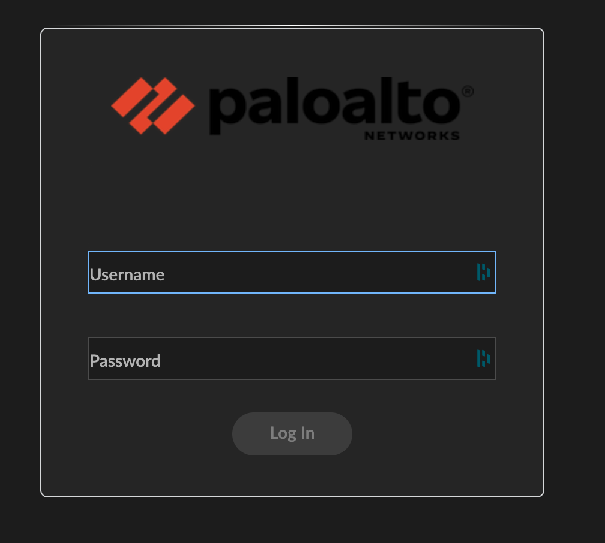
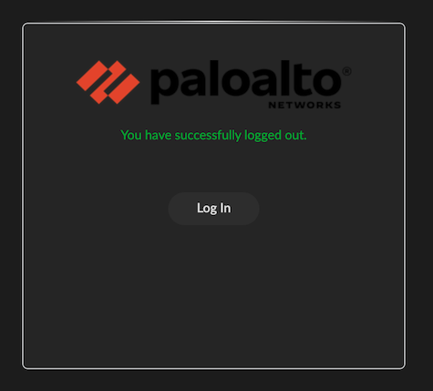

# Login That Blinded Me

A Stylus userstyle that removes the retina-searing yellow from Palo Alto Networks NGFW login and logout pages.  
Brings dark mode sanity to `/php/login.php` and `/php/logout.php` without sacrificing usability or contrast.

## Features

- Removes bright yellow background applied by PANW scripts
- Applies a dark, eye-pleasing theme across the entire login UI
- Fixes contrast issues in MOTD footer
- Styles inputs, buttons, and text for clean readability
- Uses CSS variables for easy customization

## Screenshots

### Login Page

### Logout Page

## Usage

### 1. Install Stylus

Install the Stylus extension for your browser:

- [Firefox – Stylus on AMO](https://addons.mozilla.org/en-US/firefox/addon/styl-us/)
- [Chrome – Stylus on Chrome Web Store](https://chrome.google.com/webstore/detail/stylus/clngdbkpkpeebahjckkjfobafhncgmne)
- [Edge – Stylus via Chrome Web Store](https://chrome.google.com/webstore/detail/stylus/clngdbkpkpeebahjckkjfobafhncgmne)

Stylus is open-source and works independently of UserStyles.org or extensions like "Stylish."

### 2. Add the Theme

1. Click the Stylus icon in your browser
2. Choose “Manage” → “Write new style”
3. Name it something like `Login-That-Blinded-Me`
4. Paste in the contents of `login-that-blinded-me.css`
5. Save the style

The theme will now auto-apply to any URL that ends in `/php/login.php*` or `/php/logout.php*`

## Customization

Edit the CSS variables at the top of the file to change:

- `--bg-main` – background behind the login panel
- `--bg-panel` – login panel itself
- `--text-main`, `--text-muted` – text colors
- `--btn-bg`, `--btn-hover`, `--accent` – button styles

## Credits

Built out of frustration with the yellow and love for your eyeballs.  
Darkness never felt so comfortable.
